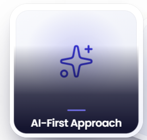

1) Ye video 16:9 ki hogi matlab puray hero section mai ayegi
2) dusra "intelligent enterprise" is color #3533cd ka hoga
3) Case study mai bhi "how clients operate" is color #3533cd ka hoga
4) Remember kai same images khaen bhi use nahi hongi aur jo images use karo title kai according use karo
5) aur ab tk jitna content likha hai usmai jaha jaha tmnay (-) ye dash use kiye hain unko hta dena
6) home page par "Why CFG" walay section mai card header ko overlap kar raha hai
7)  "Why CFG" mai card ka style mujhay bilkul aesa chayye lekin farq sirf ye hoga kai card ki height bari hogi aur title aur description arha hoga warna style yahi hogay aur slider hongay ye cards
#3533cd

Important Note: Bhai sirf problem solve karna , solve karnay kai baad details mat btana mujhay bus kehna "done"